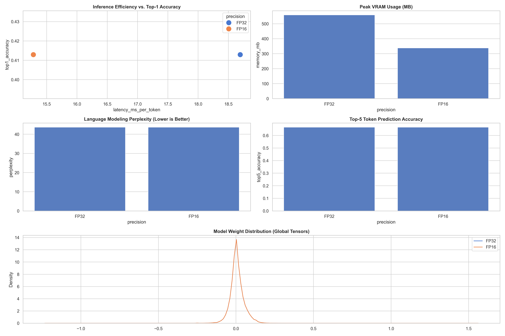

# LLM Quantization Benchmark (OPT-125M)

An advanced benchmarking suite for evaluating Large Language Model (LLM) quantization strategies. This project moves beyond simple latency checks to analyze the impact of precision reduction on model weights, language modeling perplexity, and prediction accuracy.

## Technical Analysis Features
- **Rigorous Accuracy Metrics**: Evaluates **Top-1** and **Top-5 Accuracy** on a validation slice of the WikiText-2 dataset.
- **Probabilistic Scoring**: Measures **Perplexity (PPL)** to quantify information loss across precisions.
- **Weight Distribution Analysis**: Utilizes **Kernel Density Estimation (KDE)** to visualize the structural impact of quantization on global model tensors.
- **Performance Profiling**: High-precision latency measurement (ms/token) and peak VRAM allocation tracking.
- **Multi-Hardware Optimization**:
  - **CUDA**: Support for 4-bit and 8-bit quantization via `bitsandbytes`.
  - **MPS (Apple Silicon)**: Optimized FP16/FP32 paths using Apple's Metal Performance Shaders.

## Methodology
The benchmark performs a clean load of the `facebook/opt-125m` model for each precision state to ensure no cross-contamination of memory stats. Latency is measured over multiple iterations to ensure statistical significance, focusing on token-per-second throughput rather than raw generation time.

## Requirements
- Python 3.10+
- `uv` (recommended)
- Hardware: CUDA GPU (for INT8/INT4) or Apple Silicon (for MPS).

## Execution
```bash
uv run python benchmark.py
```

## Comparative Analysis
The generated plots provide a multi-dimensional view of the quantization trade-offs:



*Key Insights:*
- **Efficiency Frontier**: Visualizes the Pareto frontier between inference speed and Top-1 accuracy.
- **Memory Compression**: Quantifies the VRAM savings provided by 8-bit and 4-bit loading.
- **Weight Drift**: The KDE plot reveals how quantization shifts the numerical distribution of the model's intelligence.

---
*Created as part of a deep-dive into LLM optimization and deployment efficiency.*
