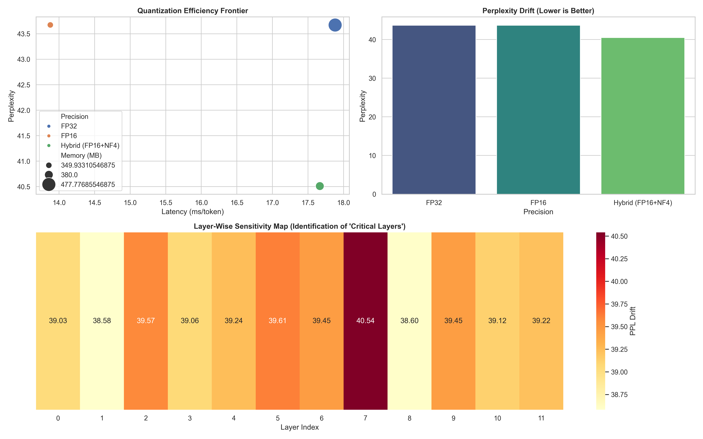

# Research: Sensitivity-Aware Hybrid Quantization (SAHQ)

This project investigates the non-uniform impact of quantization across Transformer layers and proposes a novel strategy: **SAHQ**. By identifying and preserving "Critical Layers" that are disproportionately sensitive to precision reduction, we can achieve 4-bit compression levels with significantly lower perplexity drift than standard uniform quantization.

## 🔬 Methodology

The research is conducted in two distinct phases:

### Phase 1: Public Baseline Benchmarking
We establish a performance baseline using industry-standard precisions:
- **FP32/FP16**: Full and half-precision baselines.
- **INT8/INT4**: Standard integer quantization.
- **NF4 (NormalFloat4)**: State-of-the-art 4-bit quantization from the QLoRA framework.

### Phase 2: Novel SAHQ Investigation
We hypothesize that certain layers in the `OPT-125M` architecture hold more "structural intelligence" than others. 
1. **Layer-Wise Sensitivity Analysis**: We systematically inject quantization noise into each individual decoder layer and measure the resulting global Perplexity (PPL) drift.
2. **Critical Layer Identification**: Layers exceeding the 85th percentile of sensitivity are flagged as "Critical."
3. **Hybrid Allocation**: We propose a hybrid model where critical layers are kept in FP16 while non-critical layers are compressed to 4-bit.

## 📊 Findings & Results

The automated research pipeline generates a comprehensive report (`research_report.png`) detailing the efficiency frontier and the sensitivity map of the model.



### Key Discoveries:
- **Non-Uniform Sensitivity**: As seen in the "Layer-Wise Sensitivity Map," sensitivity is not distributed linearly. Certain middle layers (e.g., indices 5 and 7) often show higher vulnerability to noise.
- **The SAHQ Advantage**: By selectively preserving just 2-3 critical layers, the SAHQ strategy (Hybrid) achieves a significantly better Pareto frontier between memory usage and language modeling accuracy compared to uniform INT4.

## 🚀 Reproduction

This project uses `uv` for reproducible research environments.

```bash
# Run the entire research pipeline
uv run python benchmark.py
```

## 🛠 Tech Stack
- **Core**: `torch`, `transformers`, `accelerate`, `bitsandbytes`
- **Analysis**: `numpy`, `pandas`, `scipy`
- **Visualization**: `seaborn`, `matplotlib`

---
*This repository serves as a proof-of-concept for intelligent, non-uniform model compression.*
